# Who's Responsible?

Design by Contract doesn't just catch bugs — it tells you **who is responsible** when something breaks.

Contracts make it clear:

- **Preconditions** must be satisfied by the **caller**
- **Postconditions** and **invariants** must be upheld by the **callee**

If a contract fails, the blame isn't vague — it's built into the system.

---

## Visual Flow

```mermaid
%%{init: {
  "theme": "base",
  "themeVariables": {
    "background": "transparent",
    "primaryColor": "#0D1B2A",
    "primaryTextColor": "#ffffff",
    "primaryBorderColor": "#4ECDC4",
    "lineColor": "#005A9C",
    "secondaryColor": "#13283F",
    "tertiaryColor": "#1B3550",
    "clusterBkg": "#0D1B2A",
    "clusterBorder": "#4ECDC4",
    "fontFamily": "Inter, sans-serif",
    "fontSize": "16px",
    "textColor": "#ffffff",
    "secondaryTextColor": "#ffffff",
    "tertiaryTextColor": "#ffffff"
  }
}}%%
flowchart TD
  Caller[Caller Code] --> A[Precondition Check]
  A -->|Valid| B[Function Body]
  A -->|Violated| F[Caller Misuse 🛑]

  B --> C[Postcondition Check]
  C -->|Valid| D[Return Result]
  C -->|Violated| G[Function Contract Breach ⚠️]
```

---

> Design by Contract doesn't just help catch errors — it helps explain them.
> It tells you not just _what_ broke, but _who_ needs to fix it.
