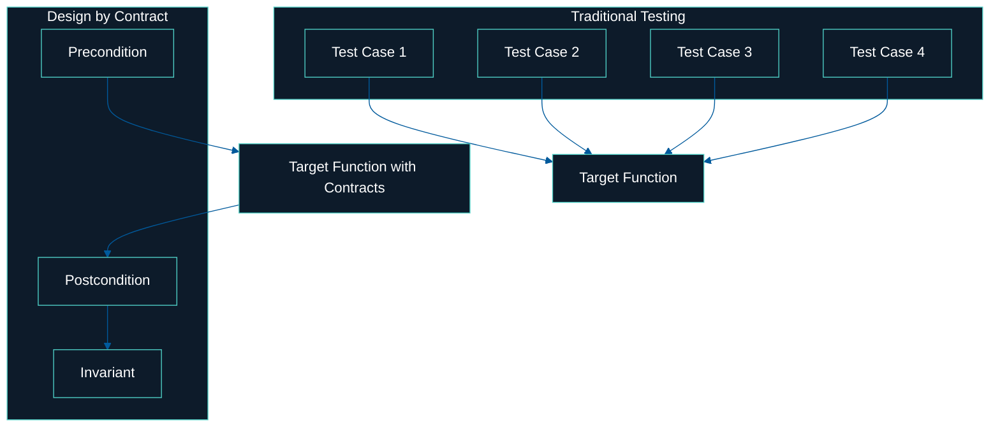

# What Contracts Replace

Most developers have a mental model that looks like this:

## Traditional Testing

```
✅ test_valid_input_returns_expected_value
❌ test_invalid_input_throws_error
✅ test_edge_case_minimum_value
✅ test_edge_case_maximum_value
✅ test_internal_state_consistency
❌ test_null_input
✅ test_output_format
```

Seven test cases. One function. And you’re never sure if you missed one.

---

## Design by Contract

```
Precondition: input must be a positive integer
Postcondition: output is a string matching /^[a-z]+$/
Invariant: internal buffer is never null
```

Three simple rules. No surprises. Always enforced.

---

## Visual Comparison



---

> Traditional tests wrap the function with dozens of cases.  
> Design by Contract wraps it with truth.
