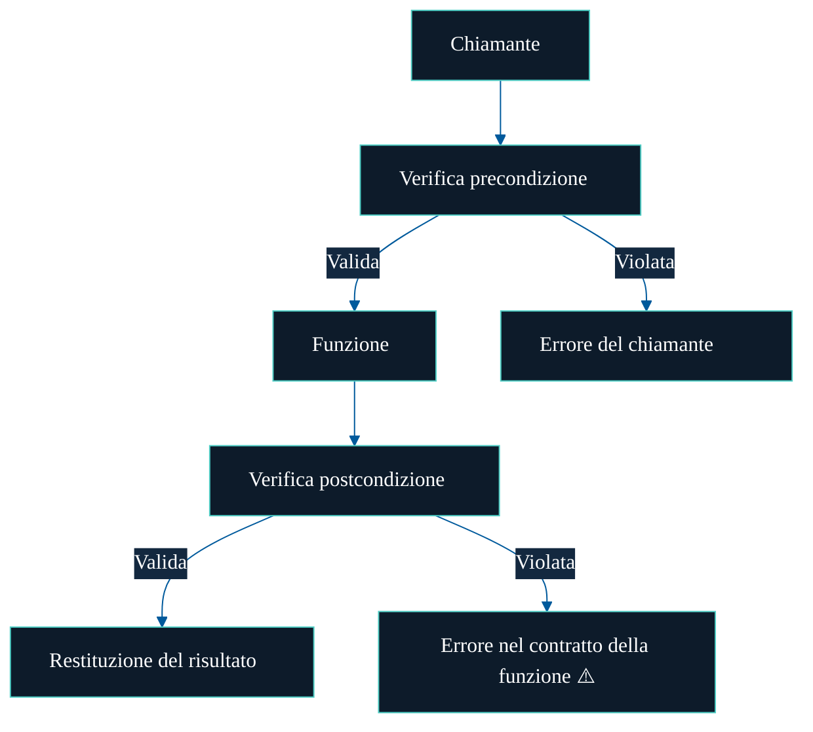

# Di chi è la responsabilità?

Il Design by Contract non si limita a rilevare gli errori — indica **chi è responsabile** quando qualcosa va storto.

I contratti rendono tutto esplicito:

- Le **precondizioni** devono essere soddisfatte da chi **chiama** la funzione
- Le **postcondizioni** e le **invarianti** devono essere rispettate da chi **implementa** la funzione

Se un contratto viene violato, non c'è ambiguità su chi abbia sbagliato — la responsabilità è scritta nel codice.

---

## Diagramma

---

> Il Design by Contract non si limita a segnalare un errore — ti dice _perché_ è successo, e _di chi è la responsabilità_.
