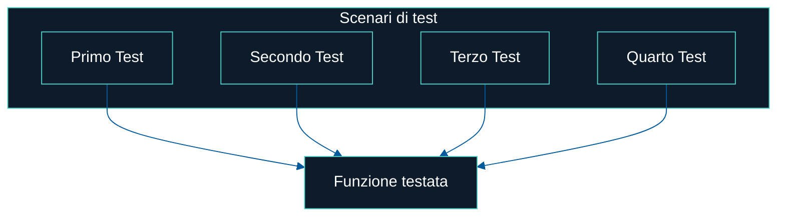
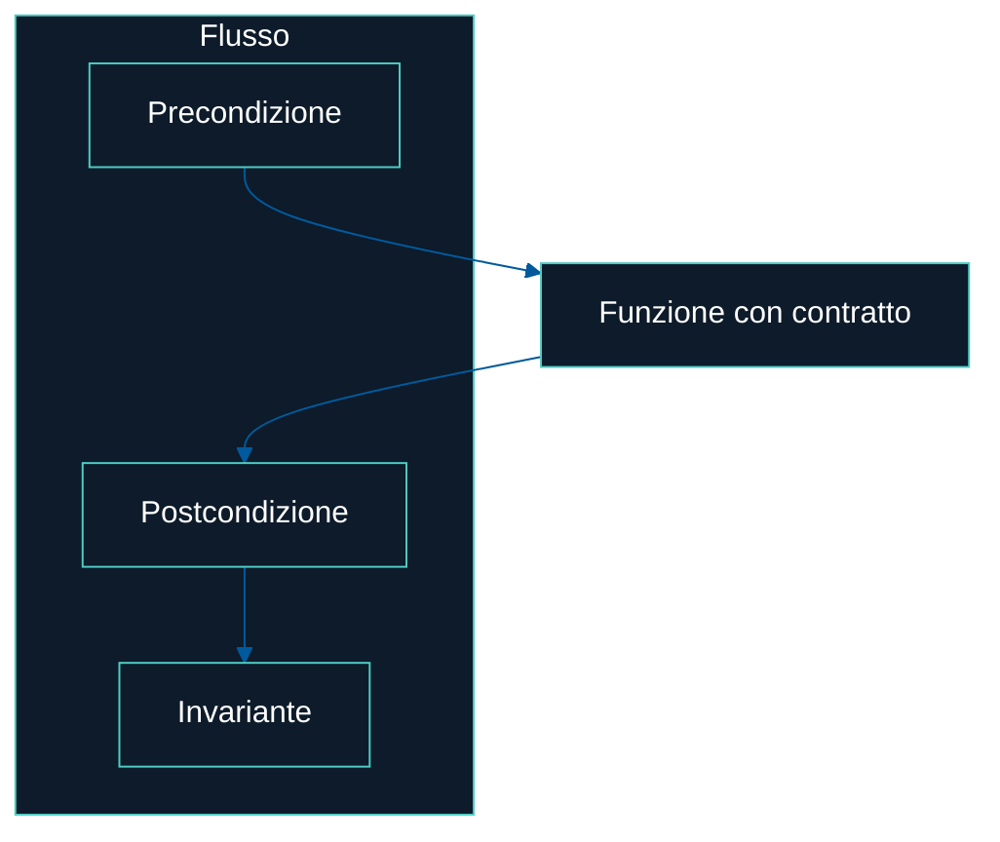

# Contratti o test?

Quando si pensa al testing, molti sviluppatori preparano una lunga lista di casi da scrivere e mantenere. Un approccio che spesso sembra infinito e, talvolta, fragile.

## Testing tradizionale

```
✅ test_input_valido_restituisce_valore_atteso
❌ test_input_non_valido_genera_errore
✅ test_valore_limite_minimo
✅ test_valore_limite_massimo
✅ test_coerenza_stato_interno
❌ test_input_nullo
✅ test_formato_output
```

Sette test per una sola funzione. E non puoi mai essere certo di aver coperto tutti gli scenari.

---

## Design by Contract

```
Precondizione: l’input deve essere un intero positivo
Postcondizione: l’output è una stringa che rispetta /^[a-z]+$/
Invariante: il buffer interno non è mai nullo
```

Tre regole chiare, sempre rispettate. Nessuna sorpresa.

---

## Confronto visivo

### Testing tradizionale



### Design by Contract



---

> I test tradizionali cercano di coprire ogni possibilità.  
> Il Design by Contract dà certezze.
